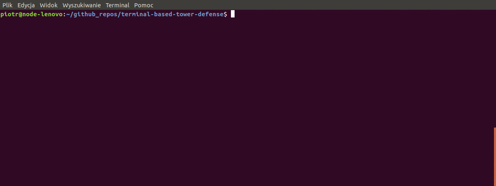
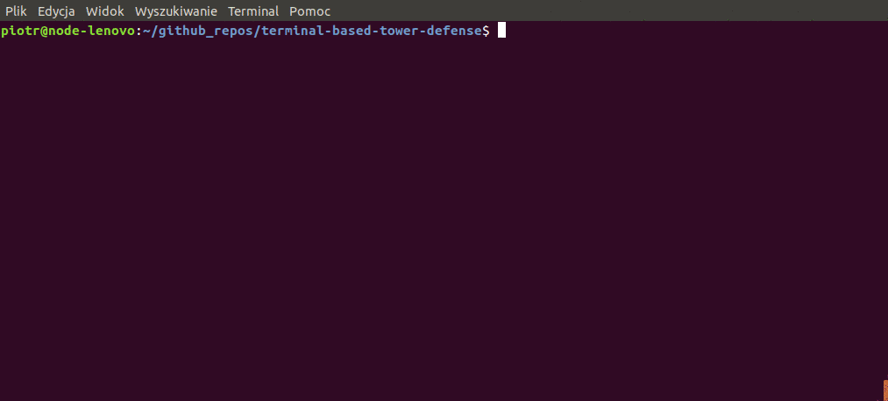

[](https://www.python.org/downloads/release/python-360/)
# Terminal-based Tower Defense


* [Installation](#installation)
* [How to play](#how-to-play)
  + [Building phase](#building-phase)
    - [Towers](#towers)
  + [Battle](#battle)
    - [Monsters](#monsters)

It is a simple terminal-based TD game. The game consists of two phases: building and battle. In the building phase the player
can buy towers. Towers are marked with capital letters (see towers). When the building phase is over the battle starts. Monsters are placed on the map and move along the path (dotted line). When a monster reaches the gate (the end of the path) life is taken from the player.
The game is over when all the lives are lost (defeat) or when all the waves are over (win).

## Installation
```bash
pip install -r requirements.txt
```

## How to play
To start the game run the following command: 
```bash
python run.py
```

The game consists of two phases: building and fight.

### Building phase


#### Towers

- Archer (A): It shoots fast but does little damage.
- Cannon (C): A slow tower for heavy units.
- Ranger (R): Wide range and moderate attack.

### Battle

Building phase was disabled for this gif. Calling "python run.py" will normally start the game with the building phase.
#### Monsters

- Speedy (s): fast, low hp
- Tank (t): slow, high hp


